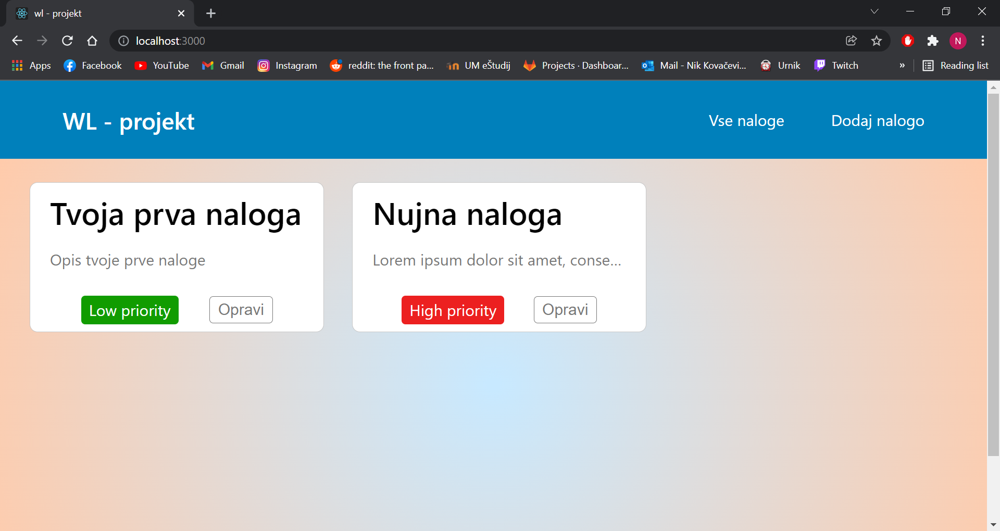
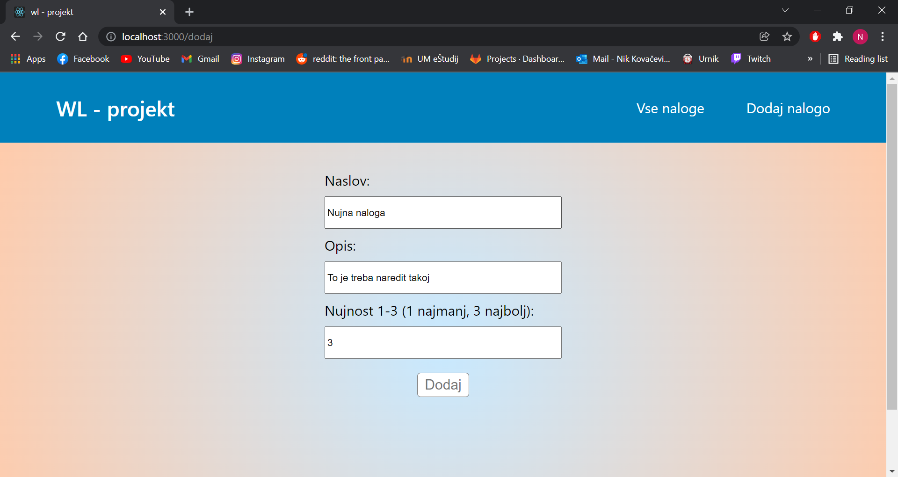
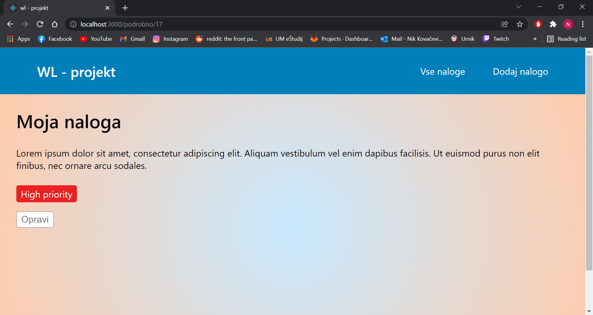

# wl-projekt

## Opis

Projekt je Todo list spletna aplikacija, narejena v okviru wl-bootcampa.

## Tehnologije

- **Frontend**: React.js ^17.0.2
- **Backend**: Spring Boot, Java 17.0.1
- **Podatkovna baza**: PostgreSQL 14.1

## Zaslonski posnetki

Pregled vseh opravil

Dodajanje opravil

Pregled podrobnosti opravil

